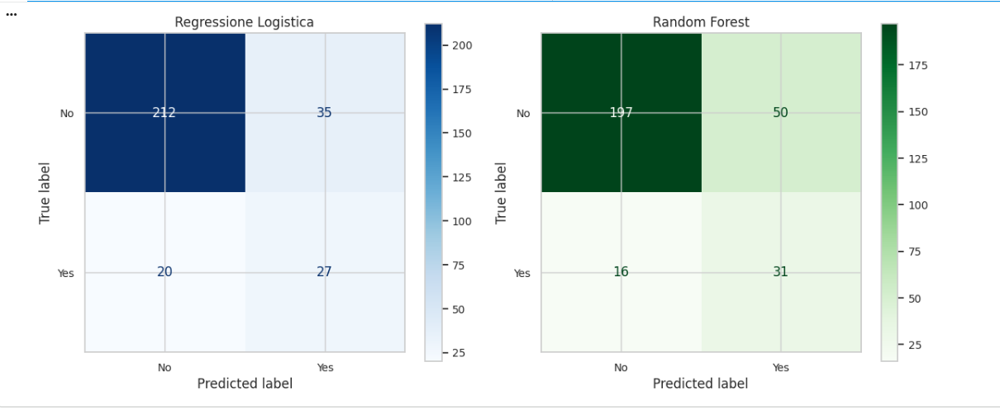
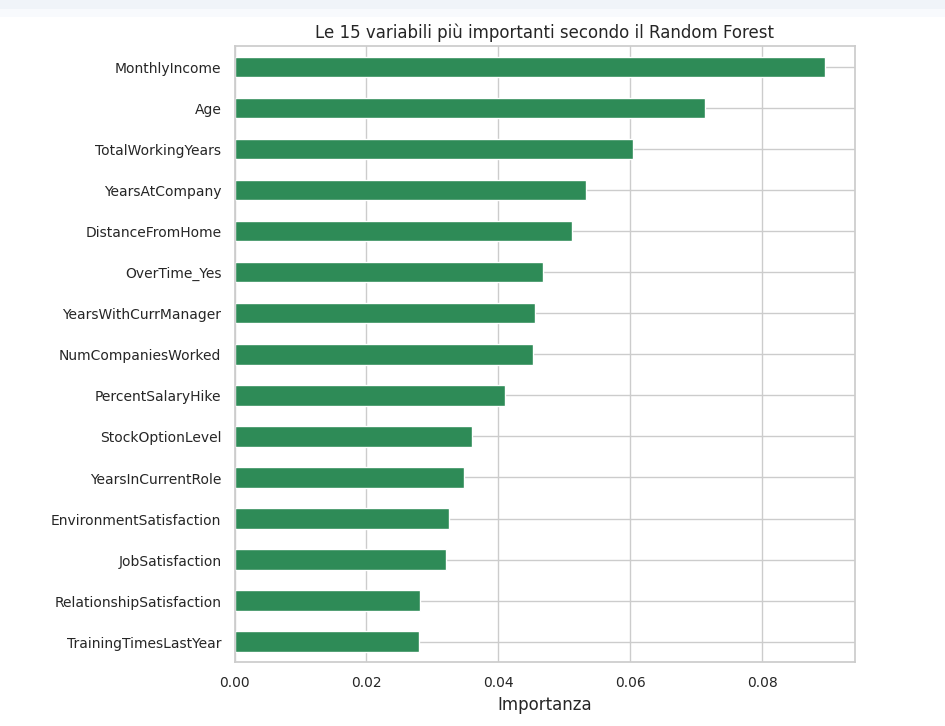

# IBM HR Analytics: Previsione del tasso di abbandono dei dipendenti (Attrition)

## Panoramica del progetto
Questo progetto analizza il dataset IBM HR Analytics sul tasso di abbandono dei dipendenti per risolvere un problema di apprendimento automatico:   
prevedere se un dipendente lascerà l'azienda. Questo è un problema di Classificazione ML perchè prevediamo un'appartenenza a una categoria.

## Dataset
Il dataset contiene record HR anonimizzati, inclusi dati demografici, ruolo lavorativo, punteggi di soddisfazione e dati retributivi.  
Variabile target:  
- `Attrition` (Sì/No) — target di classificazione

Un campione dei dati è disponibile in `data/WA_Fn-UseC_-HR-Employee-Attrition.csv`.  

## Sommario
1. Intro
2. Importazione di librerie e caricamento dei dati
3. Una occhiata alla struttura dei dati
4. Feature pulizia
5. Costruiamo Training e Test set
6. Exploratory Data Analysis - EDA
7. Preprocessing
8. Classificazione - predire Attrition (Sì/No)
9. Conclusioni e idee per il miglioramento

## Modelli usati
**Classification (Attrition):**
- Logistic Regression
- Random Forest Classifier

## Risultati

### 1. Regressione Logistica

| Metric       | Score |
|:-------------|---------:|
| Accuracy     | **0.731** |
| Precision    | **0.355** |
| Recall       | **0.830** |
| F1-score     | **0.497** |
| ROC-AUC      | **0.815** |

---

### 2. Random Forest

| Metric       | Score |
|:-------------|---------:|
| Accuracy     | **0.844** |
| Precision    | **0.844** |
| Recall       | **0.085** |
| F1-score     | **0.148** |
| ROC-AUC      | **0.808** |  

### Conclusioni e idee per il miglioramento  
Sebbene Random Forest raggiunga una maggiore accuratezza complessiva, questo dato è fuorviante a causa dello squilibrio di classe nel dataset: il modello identifica correttamente solo l'8,5% dei dipendenti che effettivamente lasciano l'azienda (recall = 0,085), il che significa che predice in gran parte la classe maggioritaria.
La regressione logistica, nonostante una minore accuratezza, raggiunge un recall di 0,83, identificando correttamente la maggior parte dei dipendenti a rischio, il che è molto più prezioso in un contesto HR, dove non segnalare un dipendente in procinto di lasciare l'azienda è più costoso di un falso allarme. Poiché entrambi i modelli mostrano un ROC-AUC simile (~0,81), la differenza risiede nel modo in cui la soglia di classificazione predefinita di 0,5 interagisce con lo squilibrio di classe, non nella capacità intrinseca dei modelli di classificare il rischio. Per questo caso d'uso, **la regressione logistica è il modello preferito**, sebbene la regolazione della soglia o la ponderazione delle classi potrebbero ulteriormente migliorare il recall di Random Forest.
